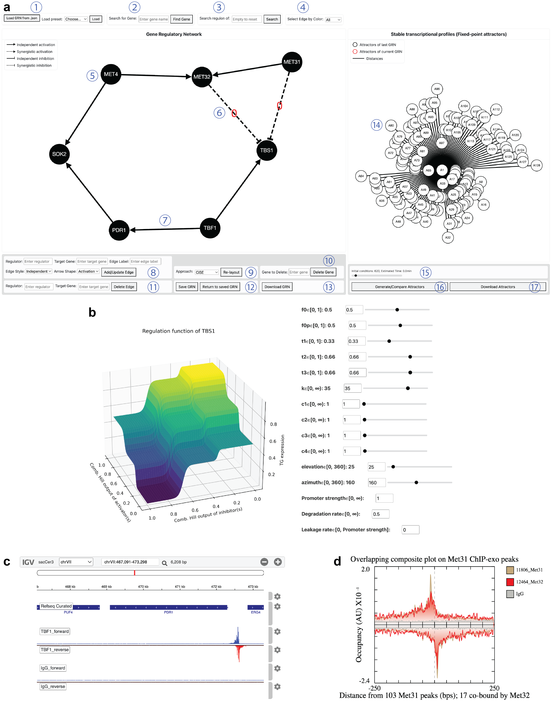

# GRN Simulator Website  
**TF–DNA Binding, Protein Colocalization, and Gene Regulatory Network Visualization**

**Ruihao Li<sup>1</sup>, William K. M. Lai<sup>1,2</sup>, B. Franklin Pugh<sup>1</sup>**  
<sup>1</sup>Department of Molecular Biology and Genetics, Cornell University, Ithaca, New York, 14853, USA  
<sup>2</sup>Department of Computational Biology, Cornell University, Ithaca, New York, 14853, USA

---

## Overview
This repository contains the source code for the **GRN Simulator web application**:  
👉 https://grn.cac.cornell.edu:5000/

The simulator enables interactive exploration, editing, and dynamical simulation of:
- TF–DNA binding networks inferred from ChIP-exo data  
- Protein–protein colocalization (PPC) networks  
- Gene regulatory networks (GRNs) inferred by **IAGREE**

The repository also includes the associated `Plotter` module used for visualization.  
Due to size constraints, processed datasets are **not included** in this repository.

---
## Website Usage Guide
For a video tutorial, please visit https://www.youtube.com/watch?v=sXdy-4LS4H8.
Open the GRN simulator website (https://grn.cac.cornell.edu:5000/) in a supported web browser (Chrome recommended).
<p align="center">
  
</p>

**(a) Main interface.**  
① Load a network either by uploading a local JSON file or by selecting a preset network, including TF–DNA binding, protein–protein colocalization (PPC), or gene regulatory network (GRN).  
② Find a gene by name and center it in the network.  
③ Subset the network to a gene of interest and its downstream targets.  
④ PPC networks only: highlight edges by STRING’s confidence category (green, very high; yellow, high; orange, medium; red, exploratory).  
⑤ Click a gene node to display its regulation function and fitted parameters.  
⑥ Click a dashed GRN edge (synergistic regulation) to view both the IGV tracks and an overlaid ChIP–exo composite plot for the two factors, highlighting similar crosslinking patterns.  
⑦ Click a solid GRN edge to view the ChIP–exo signal of the regulator TF at the target promoter in IGV (IgG shown as a negative-control track).  
⑧ Add or update an edge by specifying regulator, target, an optional complex label, edge style (solid, independent; dashed, synergistic), and sign (triangle, activation; blunt, inhibition).  
⑨ Apply a selected layout algorithm for the network.  
⑩–⑫ Delete genes or edges, and save/restore a working network state.  
⑬ Export the current network as an image and JSON.  
⑭ Stable states (attractors) of the GRN are displayed in the right panel; edges denote Euclidean distances between attractors.  
⑮ Generate evenly spaced initial conditions in expression space (with an estimated runtime).  
⑯ Integrate the GRN ODE system to identify attractors.  
⑰ Download attractor expression profiles.  

**(b)** Example regulation function and kinetic parameters for **TBS1**, editable via interactive controls.  
**(c)** Example IGV view showing ChIP–exo signal of **Tbf1** at the **PDR1** promoter.  
**(d)** Example overlaid composite plots for **Met31** and **Met32**.

---

## Dependencies
Use the following [anaconda](https://anaconda.org/) environment initialization for setting up dependencies

```bash
conda create -n GRNSim -c conda-forge -y \
    python=3.10 \
    numpy=1.26 \
    pandas=2.2 \
    scipy=1.12 \
    sympy=1.12 \
    numexpr=2.10 \
    h5py=3.11 \
    matplotlib=3.8 \
    scikit-learn=1.4 \
    pip
conda activate GRNSim
pip install flask tqdm seaborn joblib
```
---

## Deploying the Website
To deploy the GRN simulator website on your own server, run:

```bash
python app_test.py
```

We recommend using a process manager or watchdog service (e.g., systemd, supervisord, or pm2) to keep the web application running reliably.
The website source code can be used independently of the data. For the complete visualization dataset, first finish the pipeline in `../Protein_protein_interaction_network/`. Then run `./Website_backend_dataset_process.sh`, which converts the processed protein–protein interaction outputs into website-ready files and places them in `./static/data`.

---

## Interface Controls

### Upload GRN from `.json`
Upload a local JSON file containing TF–DNA binding, protein–protein colocalization, or gene regulatory networks.

---

### Add / Update Edge
Add or modify an edge by specifying:
- **Regulator** (source node)
- **Target gene** (target node)
- **Edge label** (protein complex identifier; optional)
- **Edge style**
  - `Solid`: independent regulation  
  - `Dashed`: synergistic regulation
- **Arrow type**
  - `Triangle`: activation  
  - `Blunt`: inhibition  

Click the button to add a new edge or update an existing one.

---

### Download GRN
Download the currently displayed GRN in JSON format.

---

### Delete Gene
Remove a gene (node) from the network by entering its name.

---

### Delete Edge
Remove an edge by specifying its regulator and target.

---

### Save GRN
Save the current network state to memory.

---

### Return to Saved GRN
Restore the previously saved network state.

---

### Re-layout
Select a layout algorithm from the dropdown menu and apply it to reorganize the network visualization.

---

### Find Gene
Center the visualization on a specified gene.

---

### Search
Subset the network to a gene of interest and its downstream targets.

---

### Select Edge by Color (PPC Network Only)
In protein–protein colocalization networks, edges are color-coded by confidence:
- **Green**: very high confidence  
- **Yellow**: high confidence  
- **Orange**: medium confidence  
- **Red**: exploratory  

Use the dropdown menu to highlight edges of a selected confidence level.

---

## Dynamical Simulation

### Generate / Compare Attractors
Numerically integrates the ODEs defined by the GRN structure to identify stable states (attractors).
- Attractors are shown as nodes in the right panel.
- Edges between attractors represent Euclidean distances in expression space.

---

### Download Attractors
Download both the attractor visualization and the corresponding stable-state values as a text file.

---

## Network Visualization Details

### TF–DNA Binding Network
- An edge indicates TF binding to the promoter of a target gene.
- Clicking a **solid edge** opens IGV tracks showing:
  - ChIP-exo signal of the regulator
  - IgG negative-control tracks

---

### Protein–Protein Colocalization Network
- An edge indicates that the **source factor binds at sites bound by the target factor** (directional).
- Clicking a **dashed edge** displays:
  - IGV tracks
  - Overlapped composite ChIP-exo profiles highlighting shared binding patterns

---

### Gene Regulatory Network
- Clicking a **gene node** displays its regulation function:
  - The number of plateaus corresponds to the number of discrete expression states inferred from RNA-seq
  - Axes represent combined activator and inhibitor input strengths
- Kinetic parameters are shown alongside the regulation function and can be modified interactively.
- **Solid edges** represent independent regulation and link to TF–DNA ChIP-exo signals.
- **Dashed edges** represent synergistic regulation:
  - Labeled with a red index identifying the regulatory complex
  - Clicking displays both IGV tracks and composite plots

---
